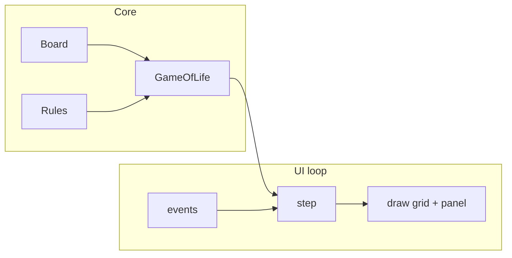

# Conway's Game of Life

Active implementation under `src/`: a finite-grid simulator for [Conway's Game of Life](src/docs/conways-game-of-life.md) with a **real-time UI** powered by [pygame-ce](https://github.com/pygame-community/pygame-ce). The frozen reference copy lives in [`src/legacy/`](src/legacy/).

## Project summary

The program models cells that are either **alive** (1) or **dead** (0). On each **generation**, cells update under classic B3/S23 rules (see [Conway's Game of Life](src/docs/conways-game-of-life.md)).

1. Setup screen (paused): configure board size or sphere frequency, neighborhood, topology, max generations, and random rate.
2. **Start** seeds the board; simulation stays paused until you resume.
3. Advances in a pygame-ce window; stops on a repeating pattern (period 1–6) or max iterations.
4. Side panel: setup controls before Start; stats and shortcuts during the run.

| Module | Role |
|--------|------|
| [`board.py`](src/board.py) | `FlatBoard` grid state (alias `Board`); live-cell set, seeding |
| [`geodesic_board.py`](src/geodesic_board.py) | Sphere board on geodesic mesh |
| [`geodesic_mesh.py`](src/geodesic_mesh.py) | Icosahedral subdivision, adjacency, render polygons |
| [`topology.py`](src/topology.py) | `Topology` enum: Bounded / Toroidal / Sphere |
| [`rules.py`](src/rules.py) | 4- or 8-connected neighborhood; bounded or toroidal (flat only) |
| [`game.py`](src/game.py) | Conway logic, `step()`, `make_game()` factory |
| [`ui/pygame_app.py`](src/ui/pygame_app.py) | Real-time display, input, panel layout |
| [`ui/sphere_renderer.py`](src/ui/sphere_renderer.py) | 3D sphere view for geodesic mode |

Dependencies: [`requirements.txt`](requirements.txt) (`matplotlib`, `numpy`, `pygame-ce`). UI code uses `import pygame` (pygame-ce is a drop-in replacement).

## Documentation index

- [Conway's Game of Life — rules](src/docs/conways-game-of-life.md)
- [Board module](src/docs/board.md)
- [Rules module](src/docs/rules.md)
- [Geodesic sphere](src/docs/geodesic.md)
- [Game module](src/docs/game.md)
- [Pygame UI](src/docs/ui.md)

## Running (pygame-ce — default)

```powershell
cd c:\Source\GoL
.\.venv\Scripts\Activate.ps1
pip install -r requirements.txt

cd src
..\..venv\Scripts\python.exe game.py
```

Opens **paused** on a setup screen. Adjust **board size** (or **frequency** in Sphere mode), **neighborhood** (4/8, flat only), **topology** (Bounded / Toroidal / Sphere), **max generations**, and **random rate** with **+/-** buttons (or mouse), then click **Start** or press **Enter**. Those settings lock once the run begins. Default **FPS cap: 15**.

Default values: **64×64** board, **8-neighbor** neighborhood, **Bounded** topology, **50%** random fill, **2500** max generations. Sphere default frequency: **ν = 8** (642 cells).

### Controls (setup — before Start)

| Input | Action |
|-------|--------|
| +/- buttons | Change board size / frequency, neighborhood, topology, max generations, random rate |
| **Start** / **Enter** | Seed board and begin (stays paused until Space) |
| Esc / Q | Quit |

### Controls (during run)

| Key | Action |
|-----|--------|
| Space | Pause / resume |
| R | Back to setup (config editable again) |
| +/- | Steps per frame |
| Up / Down | FPS cap |
| Left | Step back one generation (pauses first) |
| Right | Step forward one generation (pauses first) |
| Drag (Sphere) | Rotate 3D view |
| `[` / `]` (Sphere) | Zoom out / in |
| Esc / Q | Quit |

## Batch mode (console, no window)

```python
from board import Board
from game import GameOfLife
from rules import Rules

game = GameOfLife(Board(64), Rules(8, 64), max_iter=100, rand_rate=0.5)
game.run_simulation(verbose=True)
```

## Data flow



## Design notes

- **Finite grid** with **bounded** edges by default; optional **toroidal** wrap-around; optional **sphere** geodesic mesh (see [geodesic.md](src/docs/geodesic.md)).
- **`sequence`** still stores pre-step boards for period detection; the UI does not replay the full history.
- **Legacy** code under `src/legacy/` is unchanged (matplotlib slideshow).
