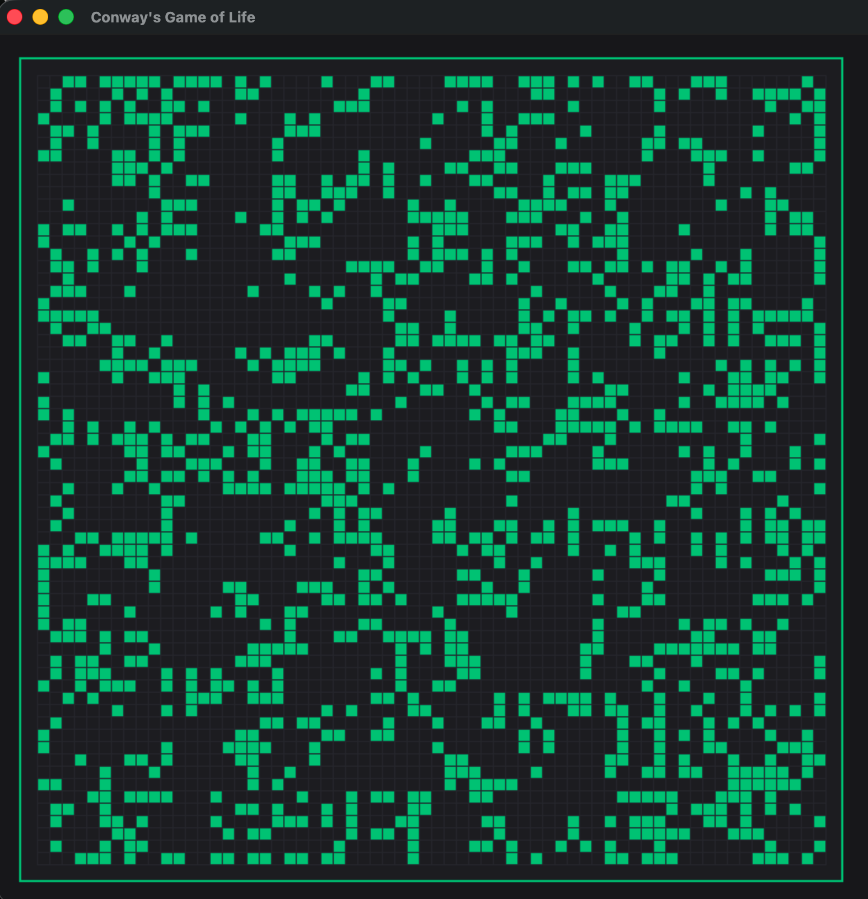
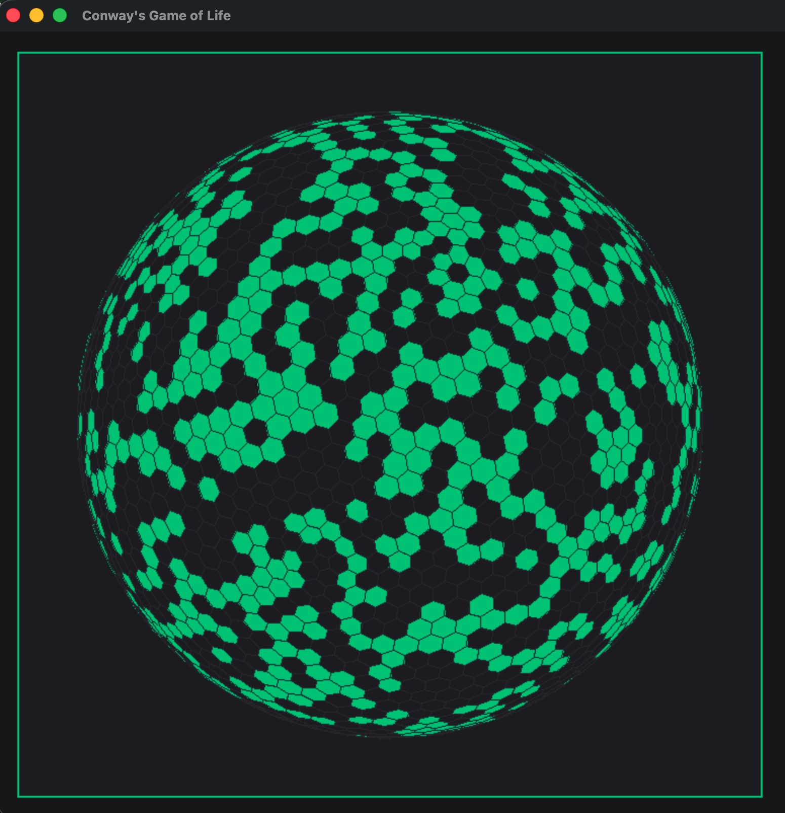
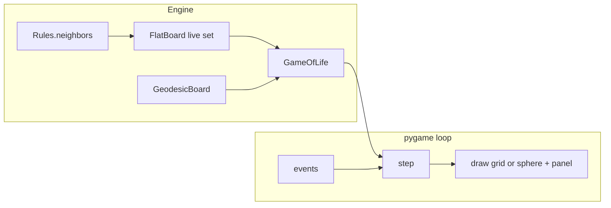

# Conway's Game of Life

Finite [Conway's Game of Life](https://en.wikipedia.org/wiki/Conway%27s_Game_of_Life) (**B3/S23**) on three topologies: **bounded** grid, **toroidal** wrap, and a **geodesic sphere**. The live view is a [pygame-ce](https://github.com/pygame-community/pygame-ce) window (`import pygame`).

An earlier matplotlib slideshow lived in this repo before the pygame port; that tree is gone. Recover it from git history if you need it.

## Screenshots

Add window captures locally (PNG or GIF). They are not generated in CI:

| View | Path |
|------|------|
| 2D grid (bounded / toroidal) | [`docs/images/grid.png`](docs/images/grid.png) |
| Geodesic sphere | [`docs/images/sphere.png`](docs/images/sphere.png) |





## Install and run

Python **3.11+**. Runtime dependencies are **numpy** and **pygame-ce** ([`pyproject.toml`](pyproject.toml)).

```bash
python -m venv .venv
source .venv/bin/activate          # Windows: .venv\Scripts\Activate.ps1
pip install -e .
gol                                # or: python -m gol
```

Contributors (tests, Ruff, mypy, coverage):

```bash
pip install -e ".[dev]"
```

`gol` opens **paused** on a setup screen. Adjust **board size** (or **frequency** in Sphere mode), **neighborhood** (4/8, flat only), **topology**, **max generations**, and **random rate**, then **Start** or **Enter**. Settings lock once the run begins. Default FPS cap: **15**.

Defaults: **64×64** board, **8-neighbor**, **bounded**, **50%** random fill, **2500** max generations. Sphere frequency **ν = 8** (642 cells).

### Controls (setup — before Start)

| Input | Action |
|-------|--------|
| +/- buttons | Change board size / frequency, neighborhood, topology, max generations, random rate |
| **Start** / **Enter** | Seed board and begin (stays paused until Space) |
| Esc / Q | Quit |

### Controls (during run)

| Key | Action |
|-----|--------|
| Space | Pause / resume |
| R | Back to setup (config editable again) |
| +/- | Steps per frame |
| Up / Down | FPS cap |
| Left | Step back one generation (pauses first) |
| Right | Step forward one generation (pauses first) |
| Drag (Sphere) | Rotate 3D view |
| `[` / `]` (Sphere) | Zoom out / in |
| Esc / Q | Quit |

## Headless engine

```python
from gol.board import FlatBoard
from gol.game import GameOfLife, make_game
from gol.rules import Rules
from gol.topology import Topology

game = GameOfLife(FlatBoard(64), Rules(8, 64), max_iter=100, rand_rate=0.5)
game.run_simulation(verbose=True)

sphere = make_game(Topology.SPHERE, frequency=8, max_iter=100, rand_rate=0.5)
sphere.run_simulation(verbose=False)
```

## Architecture

Boards are a **sparse live-cell set**, not a dense 0/1 array. Flat cells are `(row, column)`; sphere cells are geodesic mesh vertex ids. `GameOfLife` steps that set, snapshots live cells for undo and period detection, and the pygame loop draws a 2D grid or a 3D sphere.



| Module | Role |
|--------|------|
| [`gol/board.py`](gol/board.py) | `FlatBoard` (alias `Board`); live-cell set, seeding |
| [`gol/geodesic_board.py`](gol/geodesic_board.py) | Sphere board on the geodesic mesh |
| [`gol/geodesic_mesh.py`](gol/geodesic_mesh.py) | Icosahedral subdivision, adjacency, render polygons |
| [`gol/topology.py`](gol/topology.py) | `Topology`: Bounded / Toroidal / Sphere |
| [`gol/rules.py`](gol/rules.py) | 4- or 8-connected neighbors; bounded or toroidal (flat only) |
| [`gol/game.py`](gol/game.py) | B3/S23 step, period stop, `make_game()` |
| [`gol/ui/pygame_app.py`](gol/ui/pygame_app.py) | Window, input, setup / running panels |
| [`gol/ui/sphere_renderer.py`](gol/ui/sphere_renderer.py) | 3D sphere view |

## Design notes

- **Sparse live set.** Occupied cells only; `area` is `len(live_cells)`. No `Board.array`.
- **Period-6 stop.** After each step, the current live set is compared to the last six snapshots. Period 1–6 still-lifes and oscillators stop the run (or max generations).
- **Geodesic dual cells.** Sphere mode is a class-I icosahedral mesh: 12 pentagons (degree 5) and the rest hexagons (degree 6). Conway B3/S23 uses mesh adjacency, not von Neumann / Moore offsets. Cell count is `10ν² + 2`.
- **`sequence`** stores pre-step **live-cell snapshots** (not deepcopy'd boards) for scrubbing and period checks.

## Testing

CI ([`.github/workflows/ci.yml`](.github/workflows/ci.yml)) runs Ruff, mypy, and pytest with an engine coverage floor on Python 3.11 and 3.12.

```bash
pytest                             # all markers
pytest -m unit
pytest -m integration
pytest -m e2e
ruff check gol tests
mypy gol
```

| Marker | What it covers |
|--------|----------------|
| `unit` | Isolated board, rules, mesh, game helpers |
| `integration` | Engine loop across modules |
| `e2e` | pygame UI with dummy SDL (`tests/conftest.py` sets `SDL_VIDEODRIVER=dummy`) |

## License

[MIT](LICENSE)
