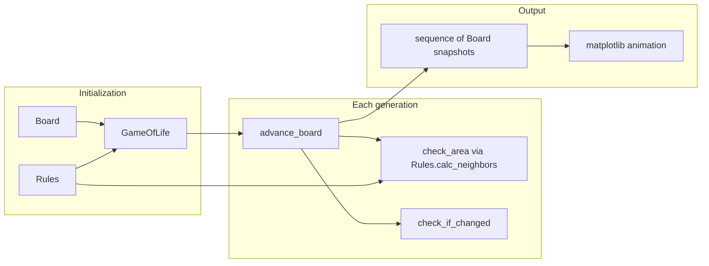

# Conway's Game of Life — Legacy Simulation

This folder documents the **legacy** implementation under `src/legacy/`: a finite-grid simulator for [Conway's Game of Life](conways-game-of-life.md) written in Python 3.6.

## Project summary

The program models a square grid where each cell is either **alive** (1) or **dead** (0). On each **generation**, every live cell is updated from its neighbor count, and dead cells with exactly three live neighbors can become alive. The simulation:

1. Builds an empty board and optionally fills it randomly.
2. Steps the grid forward using classic B3/S23 rules (see [Conway's Game of Life](conways-game-of-life.md)).
3. Stops early if the pattern repeats with period 1–6 (stable still life through period-6 oscillators; see `MAX_DETECTED_PERIOD` in `game.py`).
4. After the run, replays saved generations as a matplotlib animation.

The code is split into three modules:

| Module | Role |
|--------|------|
| [`board.py`](../board.py) | Grid state, live-cell set, seeding, display helpers |
| [`rules.py`](../rules.py) | Neighborhood definition (4- or 8-connected) on a bounded grid |
| [`game.py`](../game.py) | Simulation loop, Conway update rules, history and `main()` entry point |

Dependencies are listed in [`legacy_requirements.txt`](../legacy_requirements.txt) (matplotlib). The repo root also has `requirements.txt` for the same dependency.

## Documentation index

- [Conway's Game of Life — rules and terminology](conways-game-of-life.md)
- [Board module (`board.py`)](board.md)
- [Rules module (`rules.py`)](rules.md)
- [Game module (`game.py`)](game.md)

## Running the simulation

Activate the project virtual environment, install dependencies, then run `game.py` so Python can resolve sibling imports (`board`, `rules`):

```powershell
cd c:\Source\GoL
.\.venv\Scripts\Activate.ps1
pip install -r requirements.txt

# From project root
.\.venv\Scripts\python.exe src\legacy\game.py

# Or from the legacy folder
cd src\legacy
..\..\..venv\Scripts\python.exe game.py
```

Default `main()` settings: **64×64** board, **8-neighbor** Moore neighborhood, **50%** random initial density, up to **2500** generations, then an animation of each saved step.

## Data flow (high level)



## Design notes

- The grid is **finite** with **hard edges**: cells on the border have fewer neighbors; there is no toroidal wrap-around.
- Live cells are tracked in both a 2D `array` and a `cells` set for iteration; `Board.calc_area()` asserts they stay in sync.
- Conway's rules are implemented in `GameOfLife.advance_board()`, not in the `Rules` class—the latter only defines **who counts as a neighbor**.
